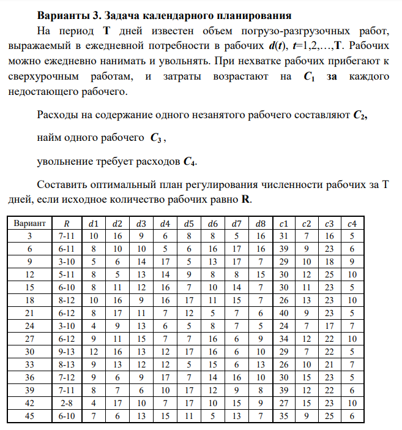

# Исследование операций

## Динамическое программирование

### Метод полного перебора

Результаты (№15):

| R   | P(min) | Путь                                           |
|-----|--------|------------------------------------------------|
| 6   | 396    | 2C3 + 3C3 + C3 + 4C3 + 7C2+2C4 + 4C2 + 0 + 7C4 |
| 7   | 373    | C3 + 3C3 + C3 + 4C3 + 7C2+2C4 + 4C2 + 0 + 7C4  |
| 8   | 350    | 0 + 3C3 + C3 + 4C3 + 7C2+2C4 + 4C2 + 0 + 7C4   |
| 9   | 338    | C2 + 2C3 + C3 + 4C3 + 7C2+2C4 + 4C2 + 0 + 7C4  |
| 10  | 326    | 2C2 + C3 + C3 + 4C3 + 7C2+2C4 + 4C2 + 0 + 7C4  |
